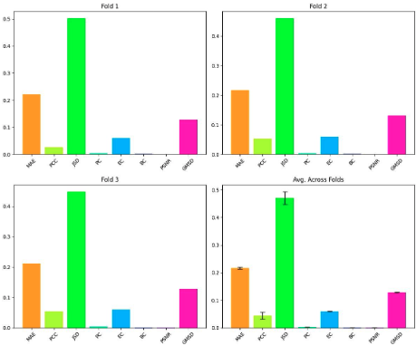

# DGL2024 Brain Graph Super-Resolution Challenge

## Contributors

- Aran Ubhi (au123)
- Daniel Kang (dk1122)
- Euan Goodbrand (eeg323)
- Lewis Kerley (lmk120)
- Majed Althonayan (ma3623)

## Problem Description

- The problem being solved is brain graph super-resolution. Brain graph super-resolution is an interesting problem to solve because it can help in reducing the time-consuming image processing, denoising, registration, and segmentation pipelines involved in MRI processing. By generating the brain graph directly at higher resolutions with more nodes, it can bypass the need for heavy image data processing.

## Name of your model - Methodology

1. Matrix Vectorization: The brain connectivity features, represented as edge weights, are vectorized to convert them into a long vector. This is done by stacking the rows of the matrix one by one.

2. LR and HR Brain Connectivity Data Preparation: Low-resolution (LR) and high-resolution (HR) brain connectivity data are prepared using LR and HR parcellation atlases. The LR and HR matrices are defined with consistent node features, and the feature size is kept the same in both LR and HR graphs.

3. Inductive Generative Model: The LR and HR matrices are used as source and target graphs, respectively. The node features for LR and HR matrices are defined in a consistent manner. The GNN mapping function is used to map the source graph to the target graph.

4. Initialization: The model can be initialized in three ways:

   - Random Initialization: The model parameters are randomly initialized.
   - Topological Initialization: The topological attributes of a given node are used to initialize the model parameters.
   - Identity Initialization: The model parameters are initialized using an identity vector.

5. Antivectorization: The off-diagonal upper triangular part of the brain graph adjacency matrix is vertically vectorized, excluding the diagonal. This results in a feature vector of size N \* (N-1)/2, where N is the number of brain regions.

6. GNN Loss Function: The loss function for the generative GNN model is defined to measure the difference between the predicted HR graph and the ground truth HR graph.


## Results



## Demo Run

```sh
$ python agsr_run.py
```

## References

Isallari, M. and Rekik, I. (2021). Brain graph super-resolution using adversarial graph neural network with application to functional brain connectivity. Medical Image Analysis, 71, p.102084. doi:https://doi.org/10.1016/j.media.2021.102084.
